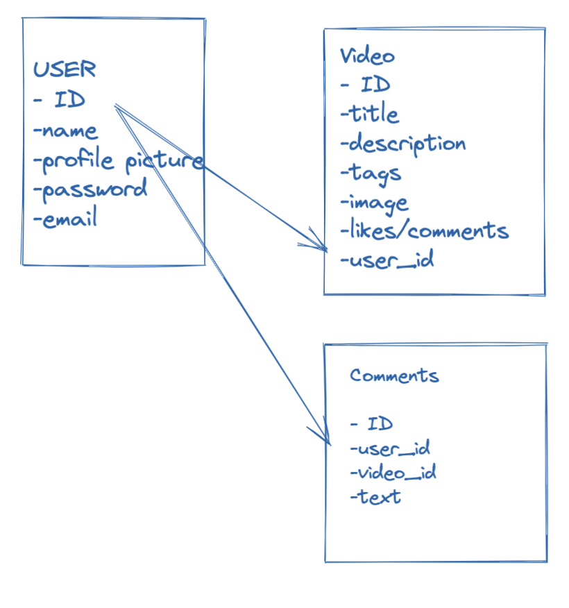

# screenfair

# User Story 
- Any user 
- can look at any video – r 
- make a profile 
- Signed in user 
- can interact with videos
- Like
- comment
- post a video - c, u, d
- curate a playlist 

# Models
- User
- Video
- Comment
- Playlist 

# User Experience
- Curated videos
- Favorite creators
- Viral videos / trends
- Scrolling/ swipe feature
- comment

# features
- Create
 - categories
 - blockchain

- Read
 - categories

- Update & Delete
- authenticated login
- user profiles
- comments

# blockers / obstacles (write words about each!)
- learning documentation for programing frameworks and api
- determining scope
- trouble shooting documentation
- dealing with deprecated technology
- scalability
- merging technologies 
- debugging 
- testing

# technology used
- python
- django

---- front end ----
- crispy forms
- Pillow
- ionicons
- bootstrap 
- videojs

---- back end ---
- allauth
- sqlite
- hashlib 
# next steps
- scalability
- organization
    - search bar
    - categories
- ethereum wallet integration
- proper security

# interesting articles
- https://www.them.us/story/chris-crocker-says-nft-sale-leave-britney-alone-video-transition
- https://www.bloomberg.com/news/articles/2022-01-25/youtube-will-explore-nft-features-for-video-creators-ceo-says 
